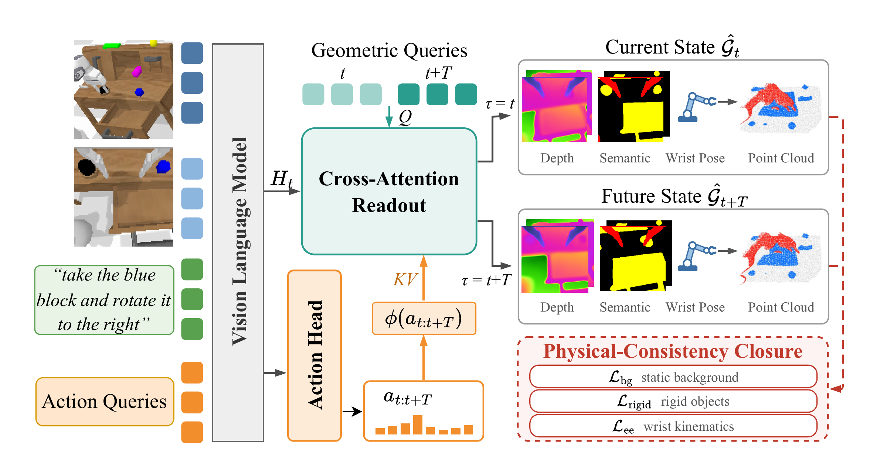

<div align="center">

# ForeAct3D

### Policy-Grounded Future World Modeling for VLA Policies

**Zhe Tao¹ · Feiran Wang² · Gaowen Liu³ · Ramana Rao Kompella³ · Yan Yan²†**

¹ University of Illinois Urbana-Champaign · ² University of Illinois Chicago · ³ Cisco  
† Corresponding author

**Learning to act by anticipating physically consistent 3D futures.**

[Overview](#overview) · [Method](#method) · [Results](#results) · [Release Resources](#release-resources) · [Citation](#citation)

</div>

## Overview

**ForeAct3D** is a framework for policy-grounded future world modeling within Vision-Language-Action (VLA) policies. It predicts how a scene will evolve under the policy's own planned action chunk, using a structured representation of **depth, semantic segmentation, and camera pose**.

The framework combines semantic 3D prediction with physical constraints on background staticity, object rigidity, and wrist-camera kinematics. These training objectives shape the shared representation used for action generation. **Future prediction is not required at inference.**

### Highlights

- **Action-conditioned futures:** future geometric queries receive the policy-generated action chunk, connecting the forecast to the planned interaction.
- **Structured semantic 3D states:** current and future predictions capture geometry and distinguish background, robot, and object regions.
- **Physical consistency:** constraints encourage a static background, approximately rigid object motion, and wrist-camera poses consistent with robot kinematics.
- **Strong manipulation results without robot pretraining:** **98.3%** average success on LIBERO and **3.73** average task length on CALVIN ABC → D.
- **Real-world gains:** average success increases from **6.7% to 37.8%** over the StarVLA-OFT base policy across three tabletop tasks.

## Method



Given a language instruction and images from an external camera and a wrist camera, ForeAct3D generates an action chunk and learns to predict the scene at the end of that action horizon.

1. **Read geometry from policy features.** Six learnable queries represent depth, segmentation, and pose at the current and future time steps. Depth and segmentation are decoded for both camera views; pose prediction targets the wrist camera.
2. **Ground the future in the planned action.** The three future queries additionally attend to features of the policy-generated action chunk. Current-state queries remain conditioned on scene features.
3. **Connect the two states through physical constraints.** Background staticity and instance-level rigidity regularize depth-derived geometry. Kinematic supervision anchors wrist-camera poses to the robot configuration.
4. **Train a better action representation.** Geometric supervision and physical consistency shape the shared policy backbone. At inference, the policy generates actions without using predicted futures to select or refine them.

The semantic head predicts three classes: **background, robot, and object**. Ground-truth instance IDs supply object-level rigidity supervision during training; the semantic head does not predict individual object identities.

## Results

All numbers below are reported in the accompanying manuscript. StarVLA-OFT is the base policy.

### LIBERO

**One model for all four suites.** Success rates are percentages; higher is better.

| Method | Spatial | Object | Goal | Long | Average |
|:--|--:|--:|--:|--:|--:|
| StarVLA-OFT | 97.8 | 98.6 | 96.2 | 93.8 | 96.6 |
| **ForeAct3D** | **99.2** | **99.2** | **98.4** | **96.2** | **98.3** |

ForeAct3D improves every suite, with an average gain of **1.7 percentage points**.

### CALVIN

**ABC → D, without robot pretraining.** Chain success rates are percentages and indicate completion of at least the specified number of consecutive tasks. Higher is better for every metric.

| Method | ≥1 task | ≥2 tasks | ≥3 tasks | ≥4 tasks | ≥5 tasks | Avg. task length |
|:--|--:|--:|--:|--:|--:|--:|
| StarVLA-OFT (reproduced) | 86.4 | 70.2 | 55.5 | 45.2 | 36.2 | 2.94 |
| **ForeAct3D** | **94.2** | **85.3** | **74.4** | **64.4** | **54.8** | **3.73** |

Average task length improves by **0.79**, with gains across all five chain lengths.

### Real-world manipulation


Experiments use the **AgileX platform**, with **50 demonstrations per task** and **15 evaluation trials per task and configuration**.

| Method | Mug → yellow area | Pen → mug | Mug → container, then pen → mug | Average |
|:--|--:|--:|--:|--:|
| StarVLA-OFT | 0.0% (0/15) | 20.0% (3/15) | 0.0% (0/15) | 6.7% |
| **ForeAct3D** | **33.3% (5/15)** | **60.0% (9/15)** | **20.0% (3/15)** | **37.8%** |

Yellow-area success requires the mug to remain inside the target region at termination. The sequential task requires completion of both stages. Across the three tasks, full successes increase from **3/45 to 17/45**.

### Component ablations

Each component contributes to the cumulative improvement on LIBERO.

| Configuration | Average success (%) |
|:--|--:|
| StarVLA-OFT | 96.6 |
| + Semantic 3D prediction | 97.3 |
| + Physical-consistency closure | 97.9 |
| + Action conditioning (**ForeAct3D**) | **98.3** |

On CALVIN, removing instance-level rigidity reduces average task length from **3.73 to 3.55**. Removing all physical-consistency terms reduces it to **3.45**.

## Release Resources

Implementation links, model checkpoints, dataset preparation instructions, and installation, training, and evaluation commands are **to be added**.

<!-- Maintainer: replace the release note with verified resources and runnable commands when available. Add the public paper URL, publication metadata, and license once confirmed. -->

## Scope and Limitations

ForeAct3D uses dense geometric supervision and instance annotations during training. Its physical constraints assume static backgrounds and approximately rigid objects. Same-pixel instance pairing is a short-horizon approximation and becomes less reliable under large motion. The reported real-world evaluation covers three tasks with 15 trials each per configuration.

## Citation

If you find this work useful, please cite the manuscript:

```bibtex
@unpublished{tao_foreact3d,
  title  = {{ForeAct3D}: Policy-Grounded Future World Modeling for {VLA} Policies},
  author = {Tao, Zhe and Wang, Feiran and Liu, Gaowen and Kompella, Ramana Rao and Yan, Yan},
  note   = {Manuscript}
}
```

## Acknowledgments

Our work builds on StarVLA-OFT and uses the LIBERO and CALVIN benchmarks. We thank their authors and maintainers for their contributions to robot learning research.
