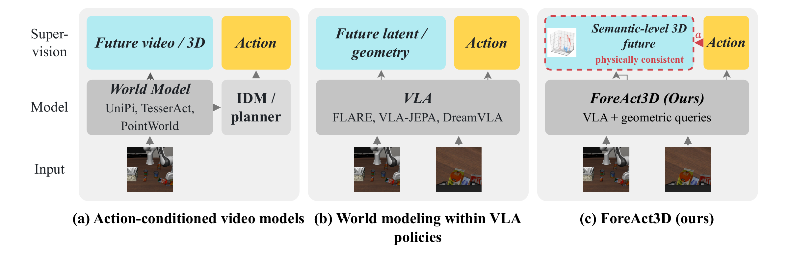
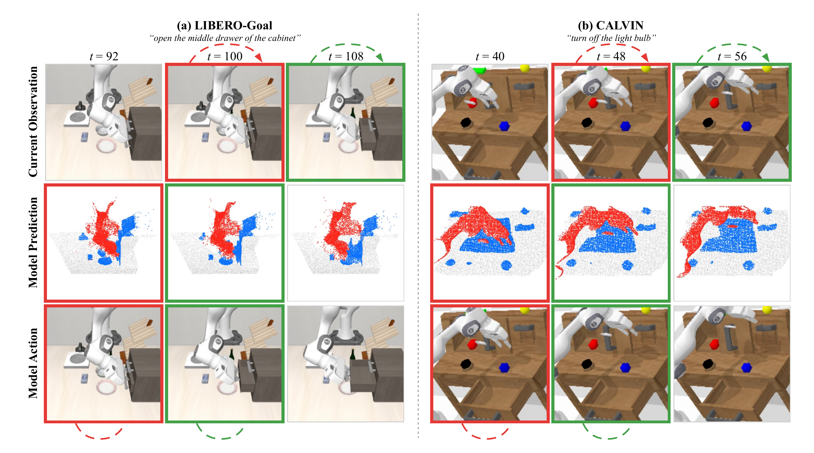
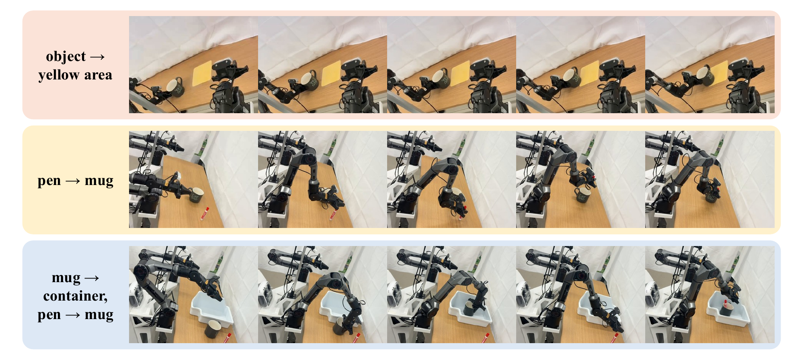

<h1 align="center">ForeAct3D</h1>
<h2 align="center">Policy-Grounded Future World Modeling for VLA Policies</h2>

<p align="center">
  <a href="https://github.com/anthonytao80-crypto/ForeAct3D"></a>
  <a href="LICENSE"></a>
</p>

<p align="center">
  
</p>

## Introduction

**ForeAct3D** is a framework for policy-grounded future world modeling within Vision-Language-Action (VLA) policies. It predicts current and future **semantic 3D scene states** through depth, segmentation, and wrist-camera pose, conditioning future predictions on the **policy-generated action chunk**. A **physical-consistency closure** connects the states through background staticity, instance-level rigidity, and end-effector kinematics. These objectives improve the shared representation used for action generation during training; **no future prediction is required at inference**.

## Results

### Scene prediction and policy execution

<p align="center">
  
</p>

Without robot pretraining, ForeAct3D achieves **98.3% average success on LIBERO** using one model for all four suites and **3.73 average task length on CALVIN ABC → D**. The figure shows current observations, predicted semantic 3D states, and execution results for drawer opening and light switching. Matching colored borders link corresponding observation and execution frames.

### Real-world manipulation

<p align="center">
  
</p>

ForeAct3D improves average success from **6.7% to 37.8%** over StarVLA-OFT across three tasks on the AgileX platform: moving a mug to the yellow area, placing a pen in a mug, and placing the mug in a container before inserting the pen. Each task uses **50 demonstrations and 15 evaluation trials per configuration**. Frames proceed from left to right.

## Citation

If you find this work useful, please consider citing our paper:

```bibtex
@unpublished{tao_foreact3d,
  title  = {{ForeAct3D}: Policy-Grounded Future World Modeling for {VLA} Policies},
  author = {Tao, Zhe and Wang, Feiran and Liu, Gaowen and Kompella, Ramana Rao and Yan, Yan},
  note   = {Manuscript}
}
```

## License

This project is licensed under the MIT License. See [LICENSE](LICENSE) for details.
